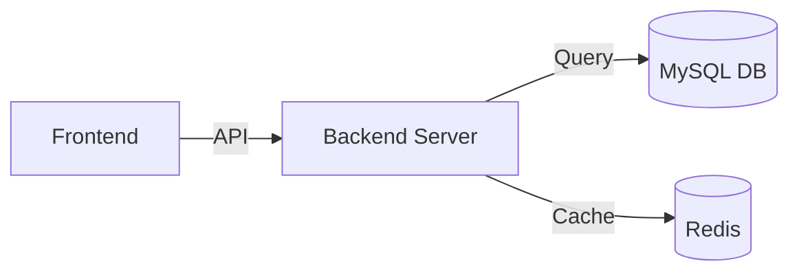

# 🐙 말 많은 무너팀 (유레카 3기 대면 벡엔드) 

<div align="center">
  

  <h3>"말은 많지만 결과는 확실한, 유레카 대면 종합 프로젝트"</h3>

  <p>프로젝트에 대한 한 줄 설명을 여기에 적어주세요.</p>

  [](#)
  [](https://opensource.org/licenses/MIT)
</div>

<br/>

## 📌 목차
1. [프로젝트 소개](#-프로젝트-소개)
2. [주요 기능](#-주요-기능)
3. [아키텍처](#-아키텍처)
4. [기술 스택](#-기술-스택)
5. [시작 가이드](#-시작-가이드)
6. [팀원 소개](#-팀원-소개)

---

## 📝 프로젝트 소개
* **개발 기간**: 2026.01.06 ~ 2026.01.27
* **서비스 명**: [서비스 이름 입력]
* **핵심 목표**: 어떤 불편함을 해결하기 위해 이 프로젝트를 기획했나요?
* **배포 주소**: [🚀 서비스 바로가기 링크]()

## ✨ 주요 기능
* **✅ 기능 1**: 기능에 대한 짧은 설명을 적으세요.
* **✅ 기능 2**: 기능에 대한 짧은 설명을 적으세요.
* **✅ 기능 3**: 기능에 대한 짧은 설명을 적으세요.

## 🏗 아키텍처
> 아래는 예시 다이어그램입니다. 실제 구조에 맞게 수정하거나 이미지를 넣으세요.



## 🛠 기술 스택

### Environment
<p>
  
  
  <a href= "https://shadow-lychee-a03.notion.site/2e0ab48eeb4b8001bb42f7c35e987cd8?source=copy_link">
    
  </a>
  <a href="https://jack36140.atlassian.net/jira/software/projects/MOONU/summary" target="_blank">
  
</a>
</p>

### Development
<p>
  
  
  
  
</p>
노션 링크에 저희 팀의 문서화가 자세히 되어있습니다.

---

## 🚀 시작 가이드

### 요구 사항 (Prerequisites)
* Java 17+, Node.js 18+
* MySQL 8.0

### 설치 및 실행
```bash
# 프로젝트 클론
$ git clone [https://github.com/your-repo/project.git](https://github.com/your-repo/project.git)

# 백엔드 실행
$ cd backend
$ ./gradlew bootRun

# 프론트엔드 실행
$ cd frontend
$ npm install && npm start
```
---

## 👥 팀원 소개

| 🐙 무너 1호 | 🐙 무너 2호 | 🐙 무너 3호 | 🐙 무너 4호 | 🐙 무너 5호 | 🐙 무너 6호 | 🐙 무너 7호 |
| :---: | :---: | :---: | :---: | :---: | :---: | :---: |
|  |  |  |  |  |  |  |
| **최훈석 (팀장)** | **윤재민** | **박유빈** | **이경윤** | **임지우** | **유효주** | **최하영** |
| [@github_id](https://github.com/) | [@github_id](https://github.com/) | [@github_id](https://github.com/) | [@github_id](https://github.com/) | [@github_id](https://github.com/) | [@github_id](https://github.com/) | [@github_id](https://github.com/) |
| Backend / DB | Frontend / UI | Backend / Infra | Frontend / Design | Backend / API | Frontend / UX | Data / QA |


---

### 🐙 무너팀의 한마디!
* **김이름**: "말은 많지만 코드는 간결하게! 끝까지 완주합시다."
* **박이름**: "즐겁게 소통하며 최고의 시너지를 내보아요!"
* **최이름**: "기술적인 도전이 기대되는 프로젝트입니다."
* **이이름**: "사용자 경험을 최우선으로 생각하겠습니다."
* **이이름**: "사용자 경험을 최우선으로 생각하겠습니다."
* **이이름**: "사용자 경험을 최우선으로 생각하겠습니다."
* **이이름**: "사용자 경험을 최우선으로 생각하겠습니다."
